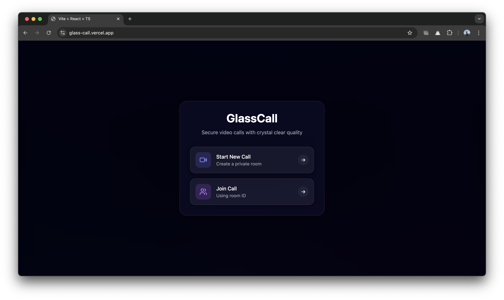
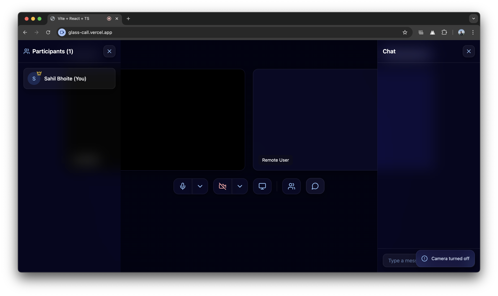
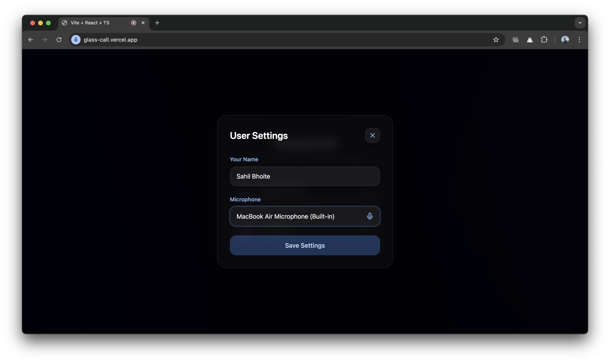

# GlassCall 🎥

GlassCall is a modern, high-performance video calling application featuring a stunning frosted glass UI design. Experience crystal-clear video calls with a beautiful, intuitive interface.

[](https://glass-call.vercel.app/)
[](https://sahil-bhoite.github.io/Portfolio/)

## 📸 Features Showcase

### Home Screen & Room Creation

*Create or join rooms with a sleek, intuitive interface*

### Video Call Interface

*Experience high-quality video calls with frosted glass UI elements*

### Joining Window

*Easy access to all essential controls and features tp join*

## ✨ Features

- **High-Quality Video Calls**: Crystal clear video and audio quality
- **Frosted Glass UI**: Modern, aesthetic interface with glass-morphism design
- **Real-Time Chat**: Send messages during calls
- **Screen Sharing**: Share your screen with one click
- **Room System**: Create or join rooms with unique IDs
- **Participant Controls**: 
  - Mute/unmute audio
  - Toggle camera
  - Raise hand feature
  - View participant list
- **Responsive Design**: Works seamlessly on desktop and mobile devices

## 🚀 Live Demo

Try GlassCall now: [https://glass-call.vercel.app/](https://glass-call.vercel.app/)

## 🛠️ Tech Stack

- **Frontend Framework**: React
- **Styling**: Tailwind CSS
- **Video Call Infrastructure**: WebRTC
- **State Management**: React Hooks
- **Build Tool**: Vite
- **Icons**: Lucide React
- **UI Components**: Shadcn/ui
- **Deployment**: Vercel

## 💻 Local Development

### Prerequisites

- Node.js (v14 or higher)
- npm or yarn

### Installation Steps

1. Clone the repository
```bash
git clone https://github.com/Sahil-Bhoite/GlassCall.git
cd GlassCall
```

2. Install dependencies
```bash
npm install
# or
yarn install
```

3. Start development server
```bash
npm run dev
# or
yarn dev
```

4. Open your browser and navigate to `http://localhost:3000`

## 📖 Usage Guide

1. **Creating a Call**
   - Visit the website
   - Click "Create Room" to generate a unique room ID
   - Share the room ID with participants

2. **Joining a Call**
   - Enter the room ID in the input field
   - Click "Join Call"
   - Grant camera and microphone permissions when prompted

3. **During the Call**
   - Use the control panel to:
     - Mute/unmute audio
     - Toggle camera
     - Share screen
     - Open chat
     - View participants
     - Raise hand

## 🤝 Contributing

Contributions are welcome! Here's how you can help:

1. Fork the repository
2. Create your feature branch (`git checkout -b feature/AmazingFeature`)
3. Commit your changes (`git commit -m 'Add some AmazingFeature'`)
4. Push to the branch (`git push origin feature/AmazingFeature`)
5. Open a Pull Request

## 📝 License

This project is licensed under the MIT License - see the [LICENSE](LICENSE) file for details.

## 👨‍💻 Author

**Sahil Bhoite**
- Portfolio: [sahil-bhoite.github.io/Portfolio](https://sahil-bhoite.github.io/Portfolio/)
- GitHub: [@Sahil-Bhoite](https://github.com/Sahil-Bhoite)


## 📞 Support

If you encounter any issues or have questions, please [open an issue](https://github.com/Sahil-Bhoite/GlassCall/issues) on GitHub.

---

Made by [Sahil Bhoite](https://sahil-bhoite.github.io/Portfolio/)
